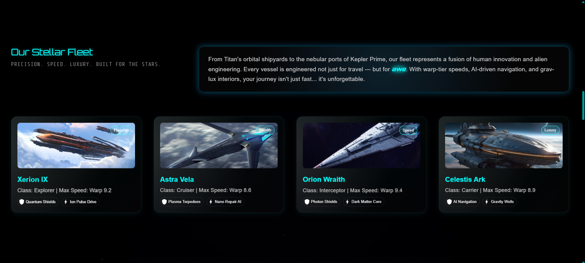

## ExoQuest
**Space Exploration Interface**

  
  

  
  
<em>Hero Section</em>

A visually immersive space exploration demo built with React + Vite
ExoQuest is a sleek, performance-focused space exploration interface crafted using modern frontend technologies. It simulates the experience of journeying through the cosmos — with stunning visuals, dynamic animations, and intuitive navigation.

## **Features**  
- **Cosmic Destinations** - Explore planets with interactive 3D visuals

 

  
  
<em>Interactive cosmic journey with smooth transitions</em>

 

- **Fleet Showcase** - Smooth spacecraft animations
  
  

  

 

- **Galaxy-Themed UI** - Dark mode with nebula accents
- **Fully Responsive** - Mobile, tablet & desktop ready 

## Why I Built This
I wanted to create something that not only looked cool but also allowed me to dive into React component design. ExoQuest is a playground to experiment, learn, and push my frontend limits.

- ## Credits
- **Imagery and concepts:** Designed and organized by me
- **Assets:** Royalty-free 
- **Logo:** Custom SVG made using Figma
- **License:** This project is licensed under the MIT License — it’s open for personal, educational, and even commercial use with attribution.
